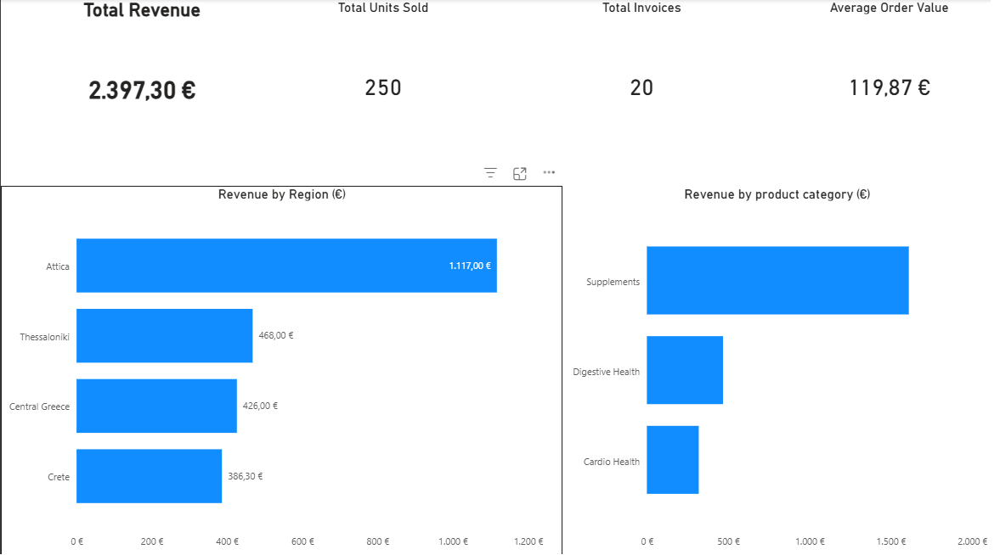

# 📊 Sales Data Analysis & Business Dashboard

This repository presents a **real-world sales analytics case study**, designed to demonstrate practical skills in **data analysis, KPI reporting, and business-oriented visualization**.

The project follows a complete **Sales / Business Analyst workflow**, from raw transactional data to executive-level insights and an interactive Power BI dashboard.

---

## 🎯 Project Objectives

- Analyze transactional sales data and extract meaningful business KPIs  
- Provide clear insights for **sales managers and decision-makers**  
- Identify revenue drivers across **regions and product categories**  
- Demonstrate an end-to-end analytics workflow suitable for real business environments  

---

## 📁 Dataset Overview

The dataset represents fictional B2B sales transactions (pharmacy channel) and includes:

- Invoice-level revenue
- Quantities sold
- Product categories
- Sales regions
- Pharmacy (customer) identifiers

📄 Source file: `data/raw_sales_data.csv`

---

## 📌 Core KPIs

The following KPIs are computed programmatically from the raw dataset:

| KPI | Value |
|---|---|
| Total Revenue | €2,397.30 |
| Total Units Sold | 250 |
| Total Invoices | 20 |
| Average Order Value (AOV) | €119.87 |
| Average Revenue per Pharmacy | €399.55 |
| Top Product Category | Supplements |
| Top Revenue Region | Attica |

> KPI values are derived directly from the raw dataset to ensure accuracy and reproducibility.

---

## 📈 Key Business Insights

- **Revenue is highly concentrated in Attica**, accounting for nearly half of total sales.
- **Supplements** are the primary revenue driver, outperforming all other product categories.
- Order values remain relatively consistent across regions, suggesting pricing stability.
- Sales performance differences are primarily volume-driven rather than price-driven.

---

## 🧠 Analytical Approach

The analysis follows a **business-first methodology**:

1. Data validation and consistency checks  
2. KPI computation using reproducible Python scripts  
3. Insight extraction aligned with sales decision-making  
4. Executive-level visualization using Power BI  

---

## 🛠️ Tools & Technologies

- **Python** (standard library) – KPI computation and validation  
- **Power BI Desktop** – Executive dashboard and visualization  
- **CSV data format** – Lightweight and transparent data handling  

---

## 📊 Interactive Sales Dashboard (Power BI)

An executive-level Power BI dashboard was created to visually support the analysis and insights.

### Dashboard Features
- KPI overview (Revenue, Units Sold, Invoices, AOV)
- Revenue breakdown by **region**
- Revenue breakdown by **product category**

📁 Power BI file:  dashboard/sales_dashboard.pbix

> The dashboard is intended to be opened with **Power BI Desktop**.

---

## 🖼️ Dashboard Preview

---

## 🔁 Reproducibility

All KPIs presented in this project are computed programmatically from the raw dataset using a dedicated Python script: scripts/compute_kpis.py

This ensures transparency, consistency, and reproducibility of results.

---

## 📌 Notes

- This repository is intended as a **portfolio project** and business case study.
- Visualizations are provided to support interpretation and decision-making.
- The focus is on **clarity, business relevance, and analytical rigor**, rather than tool complexity.

---

## 👤 Author

**Paschalis Angelopoulos**  
Data Analyst | Sales & Business Analytics  
GitHub: https://github.com/pasxalisag

📌 *This project will be updated as new analyses and insights are added.*
